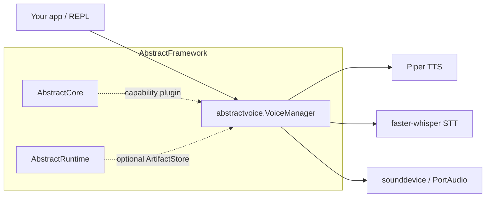

# AbstractVoice

[](https://pypi.org/project/abstractvoice/)
[](https://github.com/lpalbou/AbstractVoice/actions/workflows/ci.yml)
[](https://github.com/lpalbou/AbstractVoice/actions/workflows/ci.yml)
[](https://github.com/lpalbou/AbstractVoice/blob/main/LICENSE)
[](https://github.com/lpalbou/AbstractVoice/stargazers)

Local-first **voice I/O** for AI applications: TTS, STT, microphone control,
streaming speech output, and optional voice cloning behind a small Python API.

AbstractVoice is useful on its own, and it is also the voice capability package
for the AbstractFramework ecosystem. It does not force you to run a daemon:
embed `VoiceManager` directly when you want an in-process library; install it
beside AbstractCore when you want OpenAI-compatible HTTP audio endpoints.

- **TTS (default)**: Piper (cross-platform, no system deps)
- **STT (default)**: faster-whisper
- **Local assistant**: `listen()` + `speak()` with playback/listening control
- **Headless/server-friendly**: `speak_to_bytes()`, `speak_to_file()`, `transcribe_*`
- **Streaming TTS**: `speak_to_audio_chunks()` and `open_tts_text_stream()`
- **Voice cloning / heavier TTS (optional)**: OpenF5, Chroma, AudioDiT, OmniVoice
- **Local web example (optional)**: `abstractvoice web`
- **AbstractCore plugin**: discovered through `abstractcore.capabilities_plugins`

Status: **alpha** (`0.8.x`). The default Piper/faster-whisper path is usable
today; optional cloning and torch-based engines are heavier and should be
validated on your target hardware. The supported integrator surface is
documented in `docs/api.md`, and current engine caveats are tracked in
`docs/known-issues.md`.

Next: `docs/getting-started.md` (recommended setup + first smoke tests).
Published documentation: <https://www.lpalbou.info/AbstractVoice/>.

## Positioning: Library First, Server Through AbstractCore

AbstractVoice has three intended usage modes:

1. **Standalone Python library**: call `VoiceManager` directly from a desktop app,
   local assistant, batch job, or your own backend.
2. **Local examples**: use the REPL (`abstractvoice`) or the optional FastAPI web
   example (`abstractvoice web`) to validate `VoiceManager` from a browser.
3. **AbstractCore capability plugin**: install it next to AbstractCore and let
   AbstractCore expose voice/audio capabilities to agents and OpenAI-compatible
   clients.
4. **AbstractFramework component**: use it as the voice layer inside the wider
   AbstractFramework stack (`https://github.com/lpalbou/abstractframework`).

Key links:
- AbstractCore (agents/capabilities): `https://abstractcore.ai` and `https://github.com/lpalbou/abstractcore`
- AbstractFramework (umbrella): `https://github.com/lpalbou/abstractframework`

Integration points:

- AbstractCore capability plugin entry point: `pyproject.toml` → `[project.entry-points."abstractcore.capabilities_plugins"]`  
  Implementation: `abstractvoice/integrations/abstractcore_plugin.py`
- AbstractRuntime ArtifactStore adapter (optional, duck-typed): `abstractvoice/artifacts.py`

**Important**: AbstractVoice is a **voice I/O library** (TTS/STT + optional
cloning), not an agent framework and not a standalone LLM server. That boundary
is intentional: in the AbstractFramework stack, **AbstractCore** owns agents,
provider routing, and OpenAI-compatible HTTP endpoints; AbstractVoice supplies
the concrete voice implementation.



The shipped AbstractCore integration is via the capability plugin above. The `abstractvoice` REPL is a **demonstrator/smoke-test harness** (see `docs/repl_guide.md`) and includes a minimal OpenAI-compatible LLM HTTP client (`abstractvoice/examples/llm_provider.py`) for convenience.

### Use with AbstractCore

Install AbstractVoice into the same environment as AbstractCore:

```bash
pip install "abstractcore[server]" abstractvoice
```

AbstractCore discovers AbstractVoice through the
`abstractcore.capabilities_plugins` entry point and can use it as:

- `core.voice.tts(...)` / `llm.voice.tts(...)` for TTS
- `core.audio.transcribe(...)` / `llm.audio.transcribe(...)` for STT
- OpenAI-compatible server endpoints when AbstractCore Server is running:
  - `POST /v1/audio/speech`
  - `POST /v1/audio/transcriptions`

Minimal server smoke test:

```bash
python -m abstractcore.server.app

curl -X POST http://localhost:8000/v1/audio/speech \
  -H "Content-Type: application/json" \
  -d '{"input":"Hello from AbstractVoice through AbstractCore.","format":"wav"}' \
  --output hello.wav

curl -X POST http://localhost:8000/v1/audio/transcriptions \
  -F "file=@hello.wav" \
  -F "language=en"
```

For the current AbstractCore surface, see `https://abstractcore.ai` and
`https://github.com/lpalbou/abstractcore`.

### Use with AbstractFramework

If you’re using the full AbstractFramework stack, install and run via the umbrella project and gateway tooling. Start here: `https://github.com/lpalbou/abstractframework`.

---

## Install

Requires Python `>=3.9` (see `pyproject.toml`).

```bash
pip install abstractvoice
```

Optional extras (feature flags):

```bash
pip install "abstractvoice[all]"
pip install "abstractvoice[web]"   # local FastAPI web example
```

Notes:
- `abstractvoice[all]` enables most optional features (incl. cloning + AEC + audio-fx), but **does not** include the GPU-heavy Chroma runtime, AudioDiT, or OmniVoice.
- Python 3.9 supports the core stack, web UI, and AudioDiT TTS/prompt-audio cloning. OpenF5/F5-TTS, Chroma, and OmniVoice require Python 3.10+ because their upstream runtimes do; AEC requires Python 3.11+ because `aec-audio-processing` does.
- For the full list of extras (and platform troubleshooting), see `docs/installation.md`.

### Explicit model downloads (recommended; never implicit in the REPL)

Some features rely on large model weights/artifacts. AbstractVoice will **not**
download these implicitly inside the REPL (offline-first).

After installing, prefetch explicitly (cross-platform).

Recommended (most users):

```bash
abstractvoice-prefetch --piper en
abstractvoice-prefetch --stt small
```

Optional (voice cloning artifacts):

```bash
pip install "abstractvoice[cloning]"
abstractvoice-prefetch --openf5

# Heavy (torch/transformers):
pip install "abstractvoice[audiodit]"
abstractvoice-prefetch --audiodit

pip install "abstractvoice[omnivoice]"
abstractvoice-prefetch --omnivoice

# GPU-heavy:
pip install "abstractvoice[chroma]"
abstractvoice-prefetch --chroma
```

Equivalent `python -m` form:

```bash
python -m abstractvoice download --piper en
python -m abstractvoice download --stt small
python -m abstractvoice download --openf5   # optional; requires abstractvoice[cloning]
python -m abstractvoice download --chroma   # optional; requires abstractvoice[chroma] (GPU-heavy)
python -m abstractvoice download --audiodit # optional; requires abstractvoice[audiodit]
python -m abstractvoice download --omnivoice # optional; requires abstractvoice[omnivoice]
```

Notes:
- `--piper <lang>` downloads the Piper ONNX voice for that language into `~/.piper/models`.
- `--openf5` is ~5.4GB. `--chroma` is very large (GPU-heavy).

---

## Quick smoke tests

### REPL (fastest end-to-end)

```bash
abstractvoice --verbose
# or (from a source checkout):
python -m abstractvoice cli --verbose
```

Notes:
- Mic voice input is **off by default** for fast startup. Enable with `--voice-mode stop` (or in-session: `/voice stop`).
- The REPL is **offline-first**: no implicit model downloads. Use the explicit download commands above.
- REPL voice selection is centered on `/voices`; older commands such as
  `/profile`, `/tts_voice`, and `/setvoice` remain as compatibility/direct
  forms.
- The REPL is primarily a **demonstrator**. For production agent/server use in the AbstractFramework ecosystem, run AbstractCore and use AbstractVoice via its capability plugin (see `docs/api.md` → “Integrations”).

See `docs/repl_guide.md`.

### Local web example

```bash
pip install "abstractvoice[web]"
abstractvoice web --port 5000
```

Use `pip install "abstractvoice[web-omnivoice]"` for the browser UI plus
OmniVoice, or `pip install "abstractvoice[web-full]"` for the browser UI plus
the optional local voice/cloning engine dependencies.

Open `http://127.0.0.1:5000`. The browser example has message/conversation
playback, chat clearing, assistant/user voice selectors, browser voice cloning
from uploaded or recorded reference audio, text-to-WAV, file transcription, and
a tiny optional LLM dialogue panel for OpenAI-compatible local providers such as
Ollama or LM Studio. It exposes small local `/api/*` routes plus `/v1/audio/*`
smoke-test aliases, but the supported production HTTP path remains AbstractCore
Server.

The browser clone action validates the new voice by synthesizing a short sample
before it reports success. If the selected optional engine cannot load, the
unusable clone is removed and the UI shows the backend error.

### Minimal Python

```python
from abstractvoice import VoiceManager

vm = VoiceManager()
vm.speak("Hello! This is AbstractVoice.")
```

---

## Public API (stable surface)

See `docs/api.md` for the supported integrator contract.

At a glance:
- **TTS**: `speak()`, `stop_speaking()`, `pause_speaking()`, `resume_speaking()`, `speak_to_bytes()`, `speak_to_file()`
- **STT**: `transcribe_file()`, `transcribe_from_bytes()`
- **Mic**: `listen()`, `stop_listening()`, `pause_listening()`, `resume_listening()`

---

## Documentation

- **Published site**: <https://www.lpalbou.info/AbstractVoice/>
- **Getting started**: `docs/getting-started.md`
- **Public API**: `docs/api.md`
- **Architecture**: `docs/architecture.md`
- **FAQ**: `docs/faq.md`
- **REPL guide**: `docs/repl_guide.md`
- **Known issues**: `docs/known-issues.md`
- **Docs index**: `docs/README.md`
- **Install troubleshooting**: `docs/installation.md`
- **Multilingual support**: `docs/multilingual.md`
- **Design decisions**: `docs/adr/`
- **Acronyms**: `docs/acronyms.md`
- **Model management (Piper-first)**: `docs/model-management.md`
- **Licensing notes**: `docs/voices-and-licenses.md`

---

## Project

- **Changelog**: `CHANGELOG.md`
- **Contributing**: `CONTRIBUTING.md`
- **Known issues**: `docs/known-issues.md`
- **Bug reports**: `.github/ISSUE_TEMPLATE/bug_report.yml`
- **Security**: `SECURITY.md`
- **Acknowledgments**: `ACKNOWLEDGMENTS.md`

## License

MIT. See `LICENSE`.
